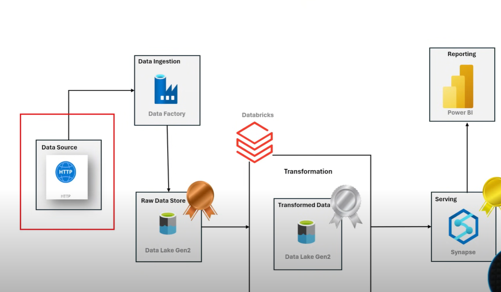
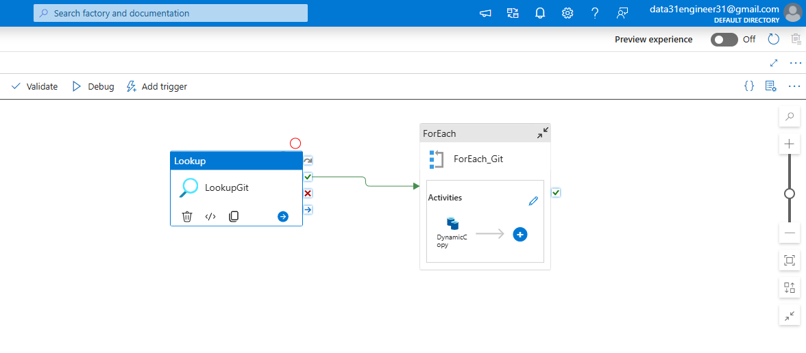

# 🏢AdventureWorks Data Engineering Pipeline (ADF + Power BI)

This project demonstrates a complete **end-to-end data engineering and analytics solution** using **Azure Data Factory**, **SQL-based transformations**, and **Power BI reporting**. The goal is to provide insights into AdventureWorks sales, products, and customer performance using modern data processing techniques and applied **Azure cloud service** to create a modern data lakehouse architecture.

---
## 🏛️ Architecture

I followed the **medallion architecture** pattern (Bronze, Silver, Gold) for organizing data at different processing stages.

#### Medallion Architecture
- **Bronze Layer**: Raw data ingestion from GitHub repository via Azure Data Factory
- **Silver Layer**: Transformed and cleaned data stored as Parquet files in Azure Data Lake Storage
- **Gold Layer**: Optimized analytics-ready data exposed through views and external tables in Azure Synapse Analytics

---

## Dataset
**AdventureWorks dataset containing**:
- Product Categories and Subcategories
- Products
- Customers
- Calendar (Date dimension)
- Sales (2015-2017)
- Returns
- Territories

**Step-1:** `Bronze Layer`
---
In **Azure Data Factory Pipelines**, I created a Dynamic Pipeline that:
- uses a **`Lookup activity`** to read configuration from `git.json`(parameters)  
Here The output from the above activity is connected to foreach loop
- applied **`ForEach`** loops to dynamically process multiple CSV files   
and Then inside the foreach activity u apply **`copydata`** Activity
- Using **`copydata`** copies data from GitHub to the **Bronze layer** in Azure Data Lake Storage

---

**Step-2:** `silver Layer`
---
- Intermediate transformations handled via **Databricks** notebooks `Transformation_silver.dbc`.
- Cleansing, normalization, and type handling are performed.
- After performing all transformation the data is pushed into silver layer in Azure Data Lake Storage using pyspark `df.write`

---

**Step-3:** `Gold Layer`
---
In **Azure synapse Analytics**,I created SQL scripts like :
- `create schema.sql`, `External Table.sql`, and `create views gold.sql` build optimized star schema views for reporting.
  
    - `create views gold.sql` uses the **OPENROWSET** function to access the data(parquet files) in Azure         data lake storage providing a sql interface over data lake without data duplication and then used          these view to create a external tables to view data for improved query performance and BI reporting.
    - `External Table.sql` we pushed the data to gold layer inform of external table.
-Azure Synapse Analytics serves as the analytics engine for your data lakehouse, providing serverless sql pool feature.

---

**Step-4:** Visualization-`Power BI`
---

## 🔧 Tools & Technologies
- **Azure Data Factory (ADF)**: Data orchestration and ingestion from dynamic GitHub sources.
- **Azure Blob Storage**: Bronze layer for raw data.
- **SQL Scripts**: Schema creation, gold layer transformations, and view generation.
- **Power BI**: Visual storytelling and dashboards.
- **GitHub**: Source for dynamic CSV datasets.

---

### 4. Visualization – Power BI
- `AdventureWorks_PowerBI_reporting.pbix` includes:
  - Sales trends and territory-wise revenue
  - Customer segmentation
  - Product performance
  - Returns and profitability dashboards

---

## 🚀 Key Features

- ✅ Automated ingestion pipeline from GitHub using dynamic parameters
- ✅ Layered data architecture (Bronze → Silver → Gold)
- ✅ Real-time insights using Power BI
- ✅ Reusable SQL scripts for schema, external tables, and reporting views

---

## 📌 Future Enhancements

- Add pipeline monitoring and alerting in ADF
- Automate Power BI dataset refresh with Azure Synapse/Logic Apps
- Integrate Databricks-based advanced analytics (RFM, clustering)

---

## 📂 How to Use

1. Update your GitHub raw URLs in `git.json`
2. Upload pipeline JSON into Azure Data Factory
3. Run pipeline to populate data into Bronze layer
4. Use SQL scripts to build schema and views
5. Open Power BI file and update data source paths
6. Publish Power BI dashboard for stakeholders

---

## 📬 Author
**[Your Name]**  
Data Engineer | Cloud Analytics Enthusiast  
[LinkedIn Profile](https://www.linkedin.com/in/your-link)  

